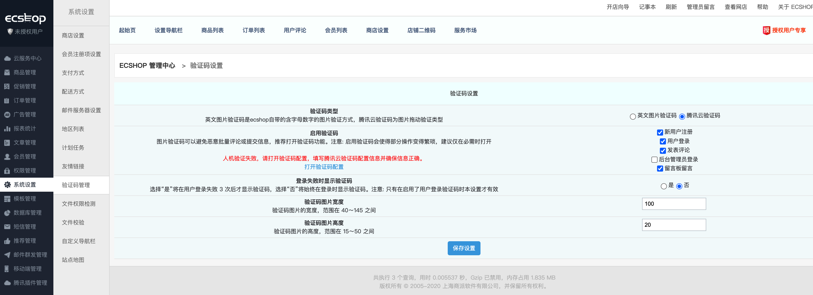

# 腾讯云验证码插件

## 1.插件介绍

> 验证码扩展是一款腾讯云研发的，提供给ECSHOP站长使用的扩展功能。基于原有的验证码基础上提供腾讯云验证码机制进行安全验证。

| 标题       | 名称                                                         |
| ---------- | ------------------------------------------------------------ |
| 中文名称   | 腾讯云验证码（CAPTCHA）插件                                  |
| 英文名称   | tencentcloud_captcha                                         |
| 最新版本   | v1.0.0 (2020.09.02)                                          |
| 适用平台   | [ECSHOP](https://www.ecshop.com/)                |
| 适用产品   | [腾讯云验证码](https://cloud.tencent.com/document/product/1110/36334)             |
| 主创团队   | 腾讯云中小企业产品中心（SMB Product Center of Tencent Cloud） |
| 反馈地址   | 请通过[咨询建议](https://support.qq.com/products/164613)向我们提交宝贵意见  |

## 2.功能特性
- 在ECSHOP上提供腾讯云的增强版验证码功能
- 支持会员登录、注册腾讯云验证码验证功能
- 支持评论、留言版留言腾讯云验证码验证功能
- 支持管理员登陆腾讯云验证码验证功能

## 3.安装指引

### 3.1.部署方式一：通过GitHub部署安装
腾讯云验证码功能兼容的ECShop版本：v4.0.7 RELEASE 20200102
> 1. git clone https://github.com/Tencent-Cloud-Plugins/tencentcloud-ecshop-plugin-captcha.git
> 2. 将tencentcloud-captcha/ecshop文件夹中相关文件的代码合并到源码中对应文件中，推荐使用代码比较工具（Beyoned Compare）进行代码合并
- **修改说明1**：ecshop/js/目录中加入腾讯云验证码依赖的TCaptcha.js文件
> 1. /ecshop/tencentcloud_captcha/ecshop/js/TCaptcha.js
- **修改说明2**：加入腾讯云验证码核心接口的依赖文件
> 1. /ecshop/includes/cls_tencentcloud_captcha.php
> 2. /ecshop/includes/cls_tencentcloud_center.php
> 3. /ecshop/includes/tencent_cloud整个目录
- **修改说明3**：修改验证码管理页面相关文件
> 1. /ecshop/admin/templates/captcha_manage.htm
> 2. /ecshop/admin/captcha_manage.php
- **修改说明4**：添加腾讯云插件管理菜单及其配置操作页面
> 1. /ecshop/admin/includes/inc_icon.php
> 2. /ecshop/admin/includes/inc_menu.php
> 3. /ecshop/admin/includes/inc_priv.php
> 4. /ecshop/admin/templates/tencent_captcha.htm
> 5. /ecshop/admin/templates/tencent_center.htm
> 6. /ecshop/admin/tencent_captcha.php
> 7. /ecshop/admin/tencent_center.php
- **修改说明5**：后台登录页面腾讯云验证码功能代码修改
> 1. /ecshop/admin/templates/login.htm
> 2. /ecshop/admin/privilege.php
- **修改说明5**：登录、注册、商品评价、留言时验证码功能相关代码修改
> 1. /ecshop/user.php
> 2. /ecshop/comment.php
> 3. /ecshop/themes/default/user_clips.dwt
> 4. /ecshop/themes/default/user_passport.dwt
> 5. /ecshop/themes/default/library/comments_list.lbi
> 6. /ecshop/includes/lib_insert.php
> 7. /ecshop/includes/lib_main.php
- **修改说明6**：语言文件修改(简体中文、繁体中文、英文)
> 1. /ecshop/languages/en_us/admin/captcha_manage.php
> 2. /ecshop/languages/en_us/admin/common.php
> 3. /ecshop/languages/en_us/admin/tencent_captcha.php
> 4. /ecshop/languages/en_us/admin/tencent_center.php
> 5. /ecshop/languages/en_us/admin/users.php
> 6. /ecshop/languages/en_us/user.php
## 4.使用指引

### 4.1. 页面功能介绍

> 合并代码后请前往系统后台-系统设置-验证码管理进行具体场景的验证码配置。英文图片验证码是系统默认的验证功能，腾讯云验证码为新增的验证功能。

> 开启腾讯验证码之后，需要在系统后台-腾讯插件管理-验证码配置页面填写验证码的配置信息

> 填写和保存验证码配置信息后可回到上一步的验证码管理也进行腾讯云验证码"人机验证"。
>

> "人机验证"通过

> "人机验证"通过失败，可能是配置信息错误导致。

### 4.2. 名词解释
- **自定义密钥**：插件提供统一密钥管理，在多个腾讯云插件时可以共享SecretId和SecretKey，支持各插件自定义密钥。
- **SecretId**：在腾讯云云平台API密钥上申请的标识身份的 SecretId,用于身份验证。详情参考[腾讯云文档](https://cloud.tencent.com/document/product)。
- **SecretKey**：在腾讯云云平台API密钥上申请的标识身份的SecretId对应的SecretKey，用于身份验证。详情参考[腾讯云文档](https://cloud.tencent.com/document/product)。
- **CaptchaAppId**： 在腾讯云短信验证码控制台应用的应用ID，该应用ID默认应用全部场景。详情参考[腾讯云文档](https://cloud.tencent.com/document/product)。
- **CaptchaAppSecretKey**： 在腾讯云短信验证码控制台应用的密钥，需和应用ID匹配。详情参考[腾讯云文档](https://cloud.tencent.com/document/product)。

## 5.FAQ

> 暂无

## 6.GitHub版本迭代记录

### 6.1 tencentcloud-ecshop-plugin-captcha v1.0.0

- 在ECSHOP上提供腾讯云的增强版验证码功能
- 支持会员登录、注册腾讯云验证码验证功能
- 支持评论、留言版留言腾讯云验证码验证功能
- 支持管理员登陆腾讯云验证码验证功能